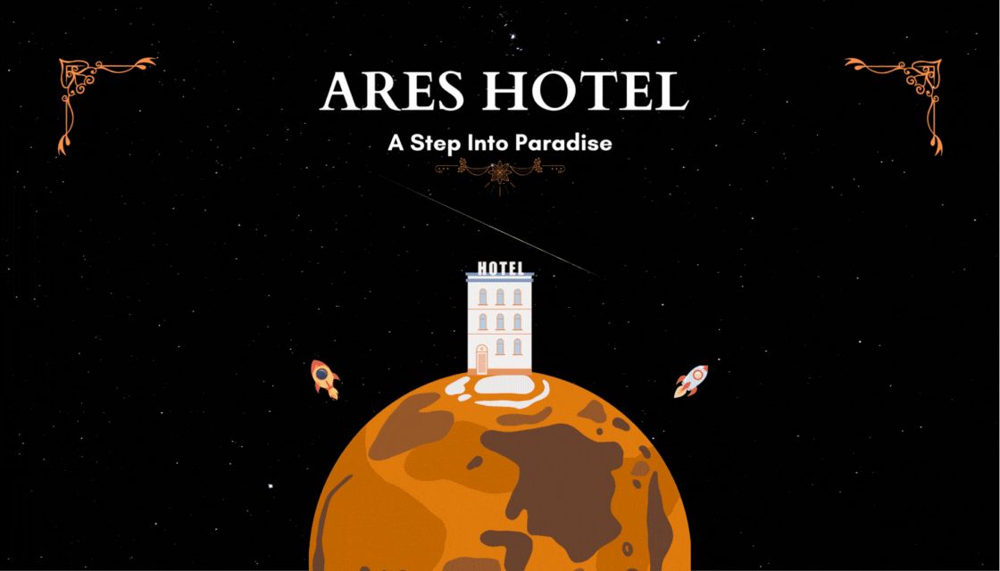

# Web Development Projects

These web development projects are built in correspondence with " [100 Days of Code - The Complete Python Pro Bootcamp](https://www.udemy.com/course/100-days-of-code/) " course. This course was taught by London's App Brewery top instructor Angela Yang. 

Each project has been built from scratch with minimal to no assistance. 

### Day 041 - Movie Ranking

This project showcases a webpage that displays my top 3 movies of all time. 

This project was built to familiarize oneself with the following topics: 
- Heading Element
- Paragraph Element
- Void Elements

For a live version, go [here](https://replit.com/@grandeurkoe/movie-ranking?v=1) .

### Day 042 - Birthday Invite

This project showcases a birthday invite webpage. 

This project was built to familiarize oneself with the following topics: 
- Anchor Element
- HTML Boilerplate
- Image Element
- Nesting and Indentation
- List Element

For a live version, go [here](https://replit.com/@grandeurkoe/birthday-invite?v=1) .

### Day 043 - Color Vocabulary

This project showcases a Color Vocubulary webpage. Learn color names in Spanish using the Color Vocabulary webpage.

This project was built to familiarize oneself with the following topics:
- CSS Selectors
- Inline, Internal and External CSS.

For a live version, go [here](https://replit.com/@grandeurkoe/color-vocab?v=1) .

### Day 044 - Motivation Meme

This project showcases a Motivation Meme webpage.

This project was built to familiarize oneself with the following topics:
- Content Division Element
- CSS Colors
- Font Properties
- The Box Model

For a live version, go [here](https://replit.com/@grandeurkoe/motivation-meme?v=1) .

### Day 058 - Tin Dog

This project showcases a Tin Dog (also known as "Tinder for Dogs") responsive webpage. This webpage was built using the Bootstrap5 framework.

For a live version, go [here](https://replit.com/@grandeurkoe/tin-dog?v=1) .

### Day 065 - Ares Hotel

This project was built using [Canva](https://www.canva.com/).

This project was built to familiarize oneself with the following topics:
- Color Theory
- Typography and Fonts
- User Experience Design
- User Interface Design

For a live version, go [here](https://www.canva.com/design/DAFv7iLyFEQ/JWuvgMKykhqIRV-YNGiUEg/view?website#4:home) .

## Getting Started

### Prerequisites

<b>For Windows:</b>
  

Download and Install the latest version of [Visual Studio Code](https://code.visualstudio.com/download). 

## Built Using

  
  
  
  
  
  
  
  

## Authors

*Initial work* - [grandeurkoe](https://github.com/grandeurkoe)
