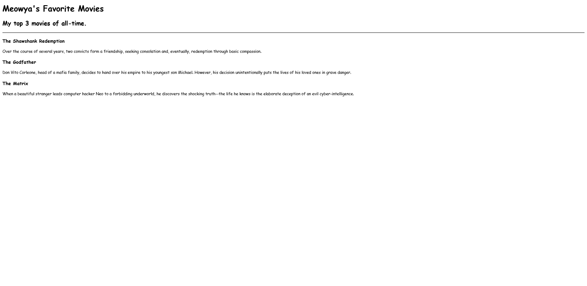
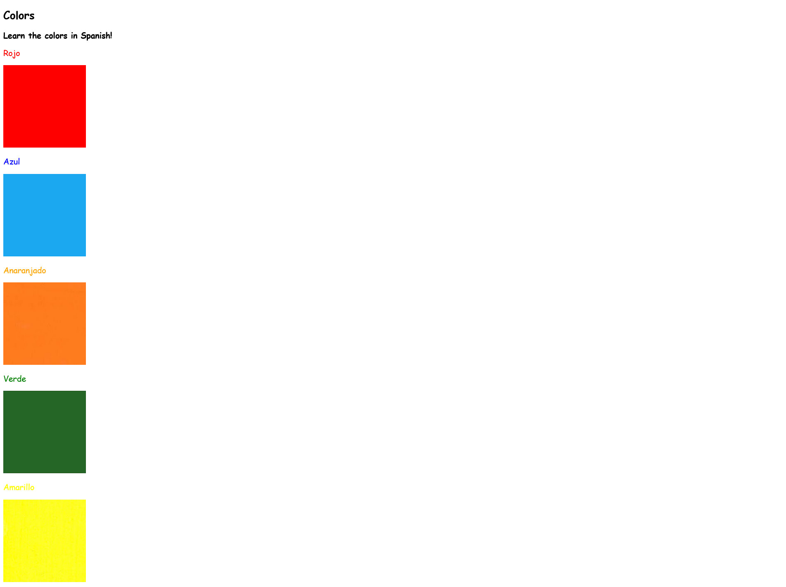
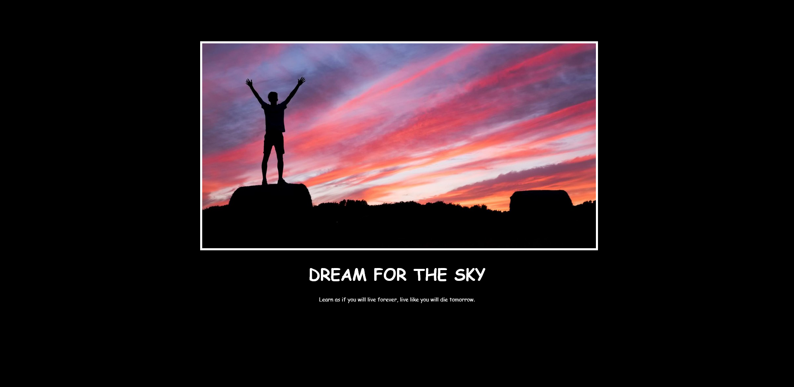

# Web Development Projects

These web development projects are built in correspondence with " [100 Days of Code - The Complete Python Pro Bootcamp](https://www.udemy.com/course/100-days-of-code/) " course. This course was taught by London's App Brewery top instructor Angela Yang. 

Each project has been built from scratch with minimal to no assistance. 

### Day 041 - Movie Ranking

This project showcases a webpage that displays my top 3 movies of all time. 

This project was built to familiarize oneself with the following topics: 
- Heading Element
- Paragraph Element
- Void Elements

For a live version, go [here](https://replit.com/@grandeurkoe/movie-ranking?v=1) .

### Day 042 - Birthday Invite

This project showcases a birthday invite webpage. 

This project was built to familiarize oneself with the following topics: 
- Anchor Element
- HTML Boilerplate
- Image Element
- Nesting and Indentation
- List Element

For a live version, go [here](https://replit.com/@grandeurkoe/birthday-invite?v=1) .

### Day 043 - Color Vocabulary

This project showcases a Color Vocubulary webpage. Learn color names in Spanish using the Color Vocabulary webpage.

This project was built to familiarize oneself with the following topics:
- CSS Selectors
- Inline, Internal and External CSS.

For a live version, go [here](https://replit.com/@grandeurkoe/color-vocab?v=1) .

### Day 044 - Motivation Meme

This project showcases a Motivation Meme webpage.

This project was built to familiarize oneself with the following topics:
- Content Division Element
- CSS Colors
- Font Properties
- The Box Model

For a live version, go [here](https://replit.com/@grandeurkoe/motivation-meme?v=1) .

